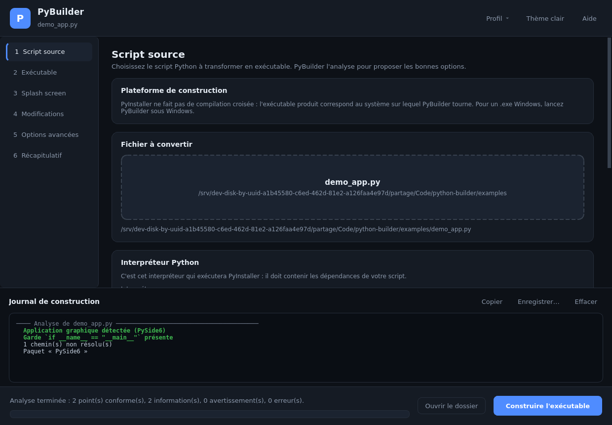

# PyBuilder

Interface graphique PySide6 qui transforme un script Python en exécutable
autonome : elle **analyse** le script, y **injecte les modifications
nécessaires**, génère le **splash screen** et lance **PyInstaller** vers le
dossier de destination de votre choix.



## Ce que fait PyBuilder

| Étape | Détail |
|---|---|
| Analyse | Lecture du script par AST : binding graphique, garde `__main__`, `multiprocessing`, ressources utilisées, paquets connus nécessitant des options PyInstaller. |
| Patch | Injection d'un bloc délimité par des marqueurs : pilotage du splash, helpers de chemins, `freeze_support()`, journal d'erreurs. |
| Visuels | Splash screen dessiné à la volée (ou image fournie) et icône `.ico` multi-résolutions, sans dépendance externe. |
| Spec | Écriture d'un fichier `.spec` complet — le seul moyen de régler finement le texte affiché sur le splash. |
| Construction | Exécution de PyInstaller dans un processus séparé, journal coloré en direct, barre de progression, annulation possible. |

## Installation

**Windows** — double-cliquez sur `lancer.bat`. Le premier lancement crée
l'environnement virtuel et installe PySide6 et PyInstaller.

**Linux** — `./lancer.sh` (PyInstaller réclame le paquet `binutils`, et le
splash screen le paquet `python3-tk`).

Installation manuelle :

```bash
python -m venv .venv
.venv/bin/pip install -r requirements.txt   # Windows : .venv\Scripts\pip
.venv/bin/python pybuilder.py               # un chemin de script peut être passé en argument
```

## Utilisation

1. **Script source** — glissez votre `.py` dans la zone de dépôt. L'analyse
   s'affiche aussitôt ; le bouton *Appliquer les options suggérées* remplit les
   imports cachés, les collectes de paquets et les ressources à embarquer.
   Vérifiez l'interpréteur proposé : c'est lui qui doit contenir les
   dépendances de votre script.
2. **Exécutable** — nom, dossier de destination, fichier unique ou dossier,
   fenêtré ou console, icône.
3. **Splash screen** — image personnalisée ou splash dessiné par PyBuilder
   (titre, sous-titre, couleur d'accent, fond clair ou sombre), avec aperçu en
   direct et choix du moment de fermeture.
4. **Modifications** — mode copie ou modification sur place, contenu du bloc
   injecté, aperçu exact du code ajouté.
5. **Options avancées** — imports cachés, `--collect-*`, exclusions,
   ressources, UPX, informations de version Windows.
6. **Récapitulatif** — commande PyInstaller et fichier `.spec` complets, puis
   **Construire l'exécutable**.

Le menu *Profil* enregistre et recharge tous ces réglages dans un fichier JSON.

## Ce que le patch ajoute à votre script

Le bloc est encadré par `# >>> PyBuilder …` / `# <<< PyBuilder …`, réécrit à
chaque construction, et **sans effet quand le script est lancé normalement**.
Il met à disposition quatre fonctions :

```python
pybuilder_close_splash()                       # ferme le splash screen
pybuilder_splash_text("Chargement des données…")  # message d'état sur le splash
pybuilder_resource_path("data", "table.csv")   # ressource embarquée (gère sys._MEIPASS)
pybuilder_app_dir()                            # dossier de l'exe, pour lire/écrire à côté
```

En mode copie (par défaut), le fichier patché `_pybuilder_<script>.py` est écrit
**à côté** de l'original — pour que les imports de modules voisins continuent de
fonctionner — puis supprimé après la construction. Votre fichier d'origine n'est
jamais modifié. En mode *sur place*, une sauvegarde `.bak` est créée.

### Quand le splash se ferme

| Stratégie | Comportement |
|---|---|
| `mainloop` | À l'entrée de la boucle d'évènements, juste après l'affichage de la fenêtre. Recommandé pour Qt et tkinter. |
| `imports` | Dès que les imports de premier niveau sont terminés. Pour les scripts console. |
| `timer` | Après le délai indiqué. |
| `manual` | Jamais : c'est votre code qui appelle `pybuilder_close_splash()`. |

Un minuteur de sécurité (30 s par défaut) ferme le splash quoi qu'il arrive,
sauf en mode manuel.

## Dépannage

**L'exécutable se ferme immédiatement.** Reconstruisez en mode console : le
message d'erreur reste affiché. Si l'option « Journal et boîte de dialogue en
cas d'erreur » est cochée, un fichier `<nom>-erreurs.log` est écrit à côté de
l'exe.

**`ModuleNotFoundError` au lancement de l'exe.** Le module est importé
dynamiquement : ajoutez-le dans *Imports cachés*, ou le paquet entier dans
*Collecte complète*.

**Un fichier de données est introuvable.** Ajoutez-le dans *Ressources
embarquées* et lisez-le avec `pybuilder_resource_path()` : dans un exe en
fichier unique, les données sont extraites dans un dossier temporaire.

**Le splash ne s'affiche pas.** Il est incompatible avec macOS, et nécessite
Tcl/Tk sous Linux (`python3-tk`).

**L'exécutable est énorme.** Excluez les bindings Qt inutilisés (le bouton
*Appliquer les options suggérées* le fait), et retirez les gros paquets non
utilisés dans *Modules exclus*.

## Limites

PyInstaller ne fait pas de compilation croisée : un `.exe` Windows se construit
**depuis Windows**. Lancé sous Linux, PyBuilder produit un binaire Linux.

## Structure

```
pybuilder/
├── analyzer.py     analyse AST du script cible
├── knowledge.py    options PyInstaller connues par paquet
├── patcher.py      bloc de code injecté
├── assets.py       splash PNG et icône ICO dessinés avec Qt
├── spec.py         génération du fichier .spec
├── builder.py      préparation, commande et exécution de PyInstaller
├── models.py       configuration sérialisable
├── settings.py     réglages persistants et profils
└── ui/             thème, composants et fenêtre principale
```

## Tests

```bash
.venv/bin/python -m unittest discover -s tests -v
```

25 tests couvrent l'analyse, le patch (validité du code produit, idempotence,
stratégies de splash, sauvegardes) et la génération du `.spec`. La chaîne
complète a par ailleurs été vérifiée de bout en bout : un exécutable construit
par PyBuilder retrouve bien ses ressources embarquées via
`pybuilder_resource_path()` et se ferme proprement.
